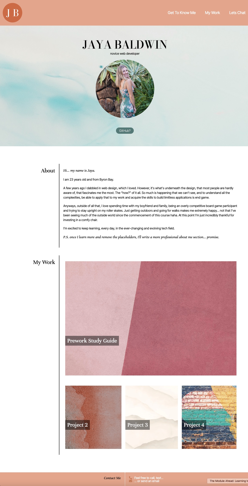
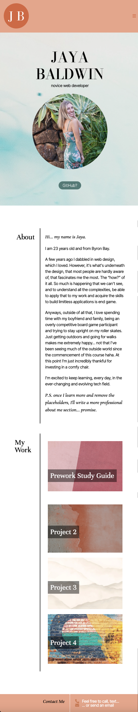
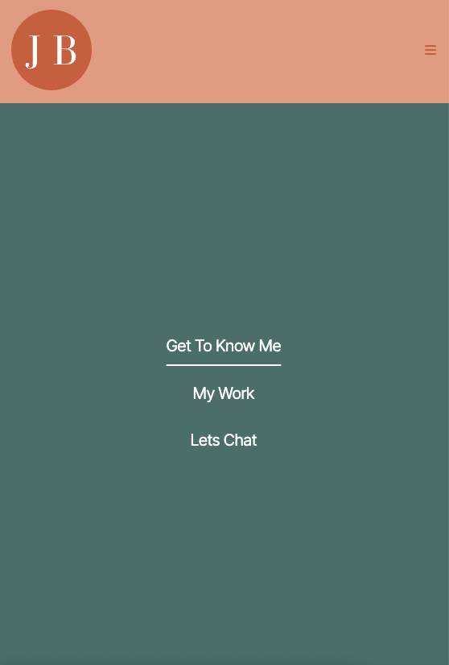

# My Portfolio

## Table of Contents

- [Criteria](#criteria)
- [Overview](#overview)
- [Built With](#built-with)
- [Acknowledgements](#acknowledgements)

## Description
For this project the Bootcamp students were required to build a portfolio to display future web applications and illustrate our skills to potential employers. This website must be built without starter code and will showcase what we have learned during our first 2 weeks of bootcamp. 

<!-- It is critical that we include our name, photo, description, examples of our work and directions on how to contact us. The links must scroll to their corresponding sections and the web application requires a resposive layout that adapts to any viewport. -->

This portfolio is designed to be continually updated over the duration of this course (and beyond). Growing and improving in fuctionality, responsivity, design and over all flair, reflecting my developing skillset.

## Criteria
- Upon loading this portfolio, I am presented with the developer's name, a recent photo or avatar, and links to sections about them, their work, and how to contact them
- The UI scrolls to the corresponding scetion upon clicking the links in the navigation 
- The UI scrolls to a section with titled images of the developer's applications
- The first application's image should be larger in size than the others
- The images of the applications link to that deployed application
- Presents a responsive layout that adapts to any viewport

## Overview
<!-- TODO: Add a screenshot of the live project.
    1. Link to a 'live demo.'
    2. Describe your overall experience in a couple of sentences.
    3. List a few specific technical things that you learned or improved on.
    4. Share any other tips or guidance for others attempting this or something similar.
 -->
Overall, with such little experience, this project had me spiralling BUT after many tutorials, support from (new) friends and restarting about 3 times (maybe more), I'm proud of the web application I produced and will continue to be updated as my skillset expands. At this stage this felt very difficult, but I'm excited to look back years from now on this project as my starting point.

I learnt ALOT during this project, prior to this I was only just grasping the premise of flexbox but was unable to apply it... no longer the case, thank gosh.

My responsivity skills have also improved (from nothing, so thats not hard) and producing a successful mobile nav bar felt like a great achievement for me. 

Main takeaway from this: it's all columns and rows, if you look hard enough!

### Screenshots
#### Desktop View

#### Mobile View

#### Responsive Navigation Bar

### Built With
- VS Code
- HTML
- CSS
<!-- TODO: List any MAJOR libraries/frameworks (e.g. React, Tailwind) with links to their homepages. -->

<!-- ## Features

TODO: List what specific 'user problems' that this application solves. -->

## Acknowledgements

<!-- TODO: List any blog posts, tutorials or plugins that you may have used to complete the project. Only list those that had a significant impact. Obviously, we all 'Google' stuff while working on our things, but maybe something in particular stood out as a 'major contributor' to your skill set for this project. -->

- Responsive navigation bar tutorial for smaller devices: [Coding Artist](https://www.youtube.com/watch?v=qKqLMlBKHlE)
- General inspiration and referncing for CSS overall: [Kevin Powell](https://www.youtube.com/@KevinPowell)
- Structure of README.md file: [GithubGist](https://gist.github.com/manavm1990/6b4c3f51a1cc7ec2fa6c3309205be0f7#file-readme-md)